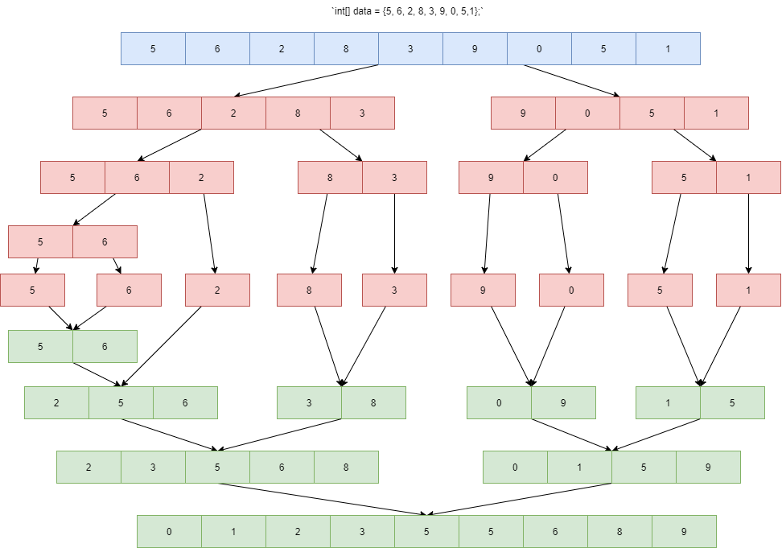

# 排序算法

排序算法有：插入排序、希尔排序、归并排序、选择排序、冒泡排序、快速排序以及堆排序。

分析一个排序算法我们通常从以下这几个方面进行分析：

1. 时间复杂度
2. 空间复杂度
3. 比较次数和交换次数
4. 稳定性：相同的两个数排完序后相对位置是否发生改变。

稳定的排序算法有什么意义呢？

比如说我们对一个班级的成绩排序中，不仅要对总的成绩进行排序，还要按照座位号的先后顺序进行排序。对于原来的成绩表，以及默认按照座位号排好序了，此时如果选择不稳定的排序算法，我们还需要进行两次的排序，比较总成绩和座位号这两个字段，而如果选择稳定的排序算法，只需要排序一次比较总成绩一个字段即可。

## 插入排序、希尔排序、归并排序

### 插入排序

艺术源自生活，算法也不例外。插入排序就像我们在打扑克时收牌的操作一样。我们的手牌分为两部分，一部分是手上已经排好顺序的牌，一部分是需要拿的没有顺序的牌。我们为了方便后续出牌，都会把后面发的没有顺序的牌一张张地插入到前面排好顺序的扑克牌。

具体的实现步骤：

1. 将数组分成已排序段和未排序段。初始化时已排序段只有一个元素；
2. 到未排序段取元素插入到已排序段，并保证插入后仍然有序；
3. 重复执行上述操作，直到未排序段元素全部加完。

我们只需要一个数组或者链表就可以实现。

代码实现如下：

[https://github.com/JackLinkai/DataStructure-Algorithm/blob/master/src/main/algorithm/sort/InsertionSort.java](https://github.com/JackLinkai/DataStructure-Algorithm/blob/master/src/main/algorithm/sort/InsertionSort.java)

由代码可知：

1. 时间复杂度：O(n^2)

2. 空间复杂度：O(n)

3. 比较的次数和交换次数：最好情况下（已经排好序），需要比较(n-1)次，移动0次；最差情况下，需要比较1+2+……+(n-1)=n(n-1)/2次，移动n(n-1)/2次。

4. 稳定性：稳定

### 希尔排序

希尔排序是插入排序的升级版，也称递减增量排序算法。因为插入排序的时间复杂度很高，如果尽量多走第二层循环的break，也就是第二次循环的循环次数减少，即序列已经排好序，则可以降低算法的时间复杂度。

希尔排序是基于插入排序的以下两点性质而提出改进方法的：

- 插入排序在对几乎已经排好序的数据操作时，效率高，即可以达到线性排序的效率；
- 但插入排序一般来说是低效的，因为插入排序每次只能将数据移动一位；

希尔排序的基本思想是：通过增量将整个待排序的记录序列分割成为若干子序列分别进行直接插入排序，随着增量逐渐减少，每组包含的关键词越来越多，当增量减至1时，整个序列中的记录"基本有序"，再对全体记录进行依次直接插入排序。

其实就是分成很多小组使序列尽可能变成有序段，因为我们通过对插入排序的分析可知，插入排序对已经排好序的序列速度是很快的。

如果理解了插入排序，希尔排序的实现就很简单了；插入排序是从下标1开始排序的每次往前1位进行大小对比，而希尔排序是从下标为增量add的位置开始排序，每次往前add位进行大小对比。

具体实现步骤：

1. 选择一个增量序列 t1，t2，……，ti ， ……，tj，……，tk，其中 ti > tj，tk = 1；
2. 按增量序列个数 k，对序列进行 k 趟排序；
3. 每趟排序，根据对应的增量 ti，将待排序列分割成若干长度为 m 的子序列，分别对各子表进行直接插入排序。仅增量因子为 1 时，整个序列作为一个表来处理，表长度即为整个序列的长度。

代码如下：

[https://github.com/JackLinkai/DataStructure-Algorithm/blob/master/src/main/algorithm/sort/HillSort.java](https://github.com/JackLinkai/DataStructure-Algorithm/blob/master/src/main/algorithm/sort/HillSort.java)

由代码可知：

1. 时间复杂度：O(n^2)
2. 空间复杂度：O(n)
3. 比较的次数和交换次数：最好情况下（已经排好序），需要比较(n-1)次，移动0次；最差情况下，需要比较1+2+……+(n-1)=n(n-1)/2次，移动n(n-1)/2次。
4. **稳定性：不稳定**

希尔排序不能在根本上解决插入排序时间复杂度高的问题，而且希尔排序还是不稳定的。

### 归并排序

归并排序是一种非常高效的排序算法，其核心思想用到了递归和分治的思想，例如，对于数组`int[] data = {5, 6, 2, 8, 3, 9, 0, 5};`进行排序过程如图：

代码如下：

[https://github.com/JackLinkai/DataStructure-Algorithm/blob/master/src/main/algorithm/sort/MergeSort.java](https://github.com/JackLinkai/DataStructure-Algorithm/blob/master/src/main/algorithm/sort/MergeSort.java)

由代码可知：

1. 时间复杂度：O(nlogn)
2. 空间复杂度：O(n)
3. 比较的次数和交换次数：最好情况下（已经排好序），需要比较(n-1)次，移动0次；最差情况下，需要比较1+2+……+(n-1)=n(n-1)/2次，移动n(n-1)/2次。
4. **稳定性：稳定**

## 选择排序、冒泡排序、快速排序

### 选择排序

选择排序的思路和插入排序非常相似，也分已排序和未排序区间。但选择排序每次会从未排序区间中找到最小（大）的元素，将其放到已排序区间的末尾。但是不像插入排序会移动数组，选择排序会每次进行交换。

代码实现：

[https://github.com/JackLinkai/DataStructure-Algorithm/blob/master/src/main/algorithm/sort/SelectSort.java](https://github.com/JackLinkai/DataStructure-Algorithm/blob/master/src/main/algorithm/sort/SelectSort.java)

由代码可知：

1. 时间复杂度：O(n^2)

2. 空间复杂度：O(n)

3. 比较次数：(n-1)+(n-2)+...+1=n(n-1)/2次，

   交换次数：最好的情况下是0次，最坏情况下是n-1次

4. 稳定性：不稳定

### 冒泡排序

冒泡排序只会操作相邻的两个数据。每次冒泡操作都会对相邻的两个元素进行比较，看是否满足大小关系要求。如果不满足就让它俩互换。一次冒泡会让至少一个元素移动到它应该在的位置，重复n次，就完成了n个数据的排序工作。

代码实现：

[https://github.com/JackLinkai/DataStructure-Algorithm/blob/master/src/main/algorithm/sort/BubbleSort.java](https://github.com/JackLinkai/DataStructure-Algorithm/blob/master/src/main/algorithm/sort/BubbleSort.java)

由代码可知：

1. 时间复杂度：O(n^2)

2. 空间复杂度：O(n)

3. 比较次数：(n-1)+(n-2)+...+1=n(n-1)/2次，

   交换次数：最好的情况下是0次，最坏情况下是n(n-1)/2次

4. 稳定性：稳定

### 快速排序

## 各种排序的对比

| 排序名称 | 时间复杂度 | 稳定性 | 额外空间开销 |
| -------- | ---------- | ------ | ------------ |
| 插入排序 | O(n^2)     | 稳定   | O(1)         |
| 希尔排序 | O(n^2)     | 不稳定 | O(1)         |
| 归并排序 | O(nlogn)   | 稳定   | O(n)         |
| 选择排序 | O(n^2)     | 不稳定 | O(1)         |
| 冒泡排序 | O(n^2)     | 稳定   | O(1)         |
| 快速排序 | O(nlogn)   | 不稳定 | O(1)         |

在选择排序算法的时候：

1. 分析场景：稳定还是不稳定
2. 数据量：数据量小优先选择插入排序
3. 分析空间

综上所述，没有一个固定的排序算法，选择排序算法都是要根据情况分析的。

一般来说要是不分析的话可以直接选择归并排序或者快排。

## 课后思考

对一个省200万学生的高考成绩（假设成绩最多只有2位数，0~900范围）进行排序，用尽可能高效的算法。

