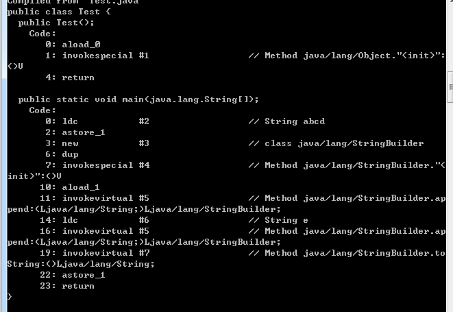

# 数组和字符串

本文参考力扣以及书籍《剑指offer》，[力扣相关内容见：https://leetcode-cn.com/explore/featured/card/array-and-string/](https://leetcode-cn.com/explore/featured/card/array-and-string/)
数组是数据结构中的基本模块之一。因为字符串是由字符数组形成的，所以二者是相似的。大多数面试问题都属于这个范畴。

## 数组
1. 集合：由一个或多个确定的元素所构成的整体。集合里的元素类型不一定相同；集合里的元素没有顺序。
2. 列表：列表（又称线性列表），是一种数据项构成的有限序列，即按照一定的线性顺序，排列而成的数据项的集合。
    列表的概念是在集合的特征上形成的，它具有顺序，且长度是可变的。
    在编程语言中，列表最常见的表现形式有数组和链表，而我们熟悉的栈和队列则是两种特殊类型的列表。
3. 数组：在Java中，首先数组的元素类型必须保持一致，其次数组中的元素在内存中是连续存储的，且每个元素占用相同大小的内存。
    数组是列表的实现方式之一，不同于列表，数组有索引，而列表没有索引。
    a. 数组定义：所谓数组，是有序的元素序列，若将有限个类型相同的变量的集合命名，那么这个名称为数组名。组成数组的各个变量称为数组的分量，也称为数组的元素，有时也称为下标变量。用于区分数组的各个元素的数字编号称为下标。数组是在程序设计中，为了方便处理，把具有相同类型的若干元素按无序排列的形式组织起来的一种形式。这些无序排列的同类数据元素的集合称其为数组。
    数组是用于存储多个相同类型数据的集合，通常用Array表示，也称为线性表。
    b. 特点：
       (1)数组是相同数据类型的元素的集合。
       (2)数组中的各元素的存储是有先后顺序的，它们在内存中按照这个先后顺序连续存放在一起，即内存地址。但元素不一定是按照特定顺序进行排列的。
       (3)数组元素用整个数组的名字和它自己在数组中的顺序位置来表示。例如，a[0]表示名字为a的数组中的第一个元素，a[1]代表数组a的第二个元素，以此类推。
    c. 表现形式
        (1)一维数组：int a[],String a[]
        (2)多维数组：int a[][],int a[][][]。
        `int a[m][n]`:内存空间是多少？ m*n，且内存空间在初始化时就已经分配好了。
    d.**随机访问**：数组是**连续的内存空间**和**相同类型**的数据。
        正是因为这两个限制，它才有了一个非常重要的特性：随机访问。
        但有利就有弊，这两个限制也让数组的很多操作变得非常低效，比如要想在数组中删除、插入一个数据，为了保证连续性，就需要做大量的数据搬移工作。
    e. **使用数组一定要注意访问越界问题。**所以一定要多加判断，尤其在开始和结束，测试的时候也需要注意头和尾。

### 数组的操作
1. 读取元素：通过数组的索引访问数组中的元素。
当申明一个数组的时候，计算机会在内存中申请一段 连续 的空间，并且会记下索引为 0 处的内存地址。
因为数组是连续的，所以要找到对应索引的内容只需要得到该索引所对应的内存地址即可，而且计算机可以跳跃到任意的内存地址上，因此只要计算出数组中元素的内存地址，则可以一步访问到数组中的元素。
可以将整个访问过程只看作一个动作，因此时间复杂度为 O(1)。
2. 查找元素：
计算机只会保存数组中索引为 0 处元素的内存地址，因此当计算机想要知道数组中是否包含某个元素时，只能从索引 0 处开始，逐步向后查询。
在最坏情况下，我们需要查询数组中的每个元素，因此时间复杂度为 O(n)，n 为数组的长度。
3. 插入元素：
如果要将该元素插入到数组的末尾，只需要一步。即计算机通过数组的长度和位置计算出即将插入元素的内存地址，然后将该元素插入到指定位置即可，时间复杂度为 O(1)。
如果要将该元素插入到数组中的其他位置，我们首先需要为该元素所要插入的位置腾出空间，这样就需要把目标位置的元素及其后面的元素一个个地往后稍稍，然后进行插入操作，时间复杂度为 O(n)，n 为数组的长度。
4. 删除元素
删除元素与插入元素的操作类似，如果是删除末尾的元素，只需要删除即可，时间复杂度为 O(1)。
当我们删除掉数组中其他位置的某个元素后，数组中会留下 空缺 的位置，而数组中的元素在内存中是连续的，这就使得后面的元素需对该位置进行 填补 操作，时间复杂度为 O(n)，n 为数组的长度。
总结：因此我们在进行数据操作时，类似于需要读取元素、插入或删除最后一个元素的，可以考虑使用数组。

### ArrayList和数组
本质是一样的，都是数组。ArrayList是JDK封装的数组，不需要管扩容等操作，数组就需要自己全部操作。所以使用数组会比使用ArrayList性能高。
两者之间如何选用：
1. 不知道数据大小选ArrayList；
2. 若知道数据的大小且非常关注性能，则选择使用数组。

### 数组下标为什么从0开始
定义一个数组一定会分配内存空间，数组的特点是在内存的一段连续的地址。
假如说我们定义一个数组，在内存中是10001开始申请空间的，那么底层申请空间是这样子的：

```java
a[0]:10001+0*typesize
a[1]:10001+1*typesize
a[2]:10001+2*typesize
……
```

因为数组在内存是连续的一段地址，所以只需要记住a[0]的地址就可以计算出其他的内存地址，实现随机访问；
但是如果下标从1开始的话：

```java
a[1]:10001+(1-1)*typesize
a[2]:10001+(2-1)*typesize
a[3]:10001+(3-1)*typesize
……
```

由于在底层计算中，减法运算很复杂，如果要涉及减法运算的话性能不高，所以数组的下标会选择从0开始而不是其他的数字开始的。
一维数组的寻址公式就是：loc(a[index])=init_loc（初始化内存地址）+index*typesize（数据长度）

### 数组实现

https://github.com/JackLinkai/DataStructure-Algorithm/blob/master/src/main/datastructure/array/MyArray.java

### 例题1：

给你一个文件里面包含全国人民（14亿）的年龄数据（0~180），现在要你统计每一个年龄有多少人？
给定机器为 单台+2CPU+2G内存。不得使用现成的容器，比如map等。
题解：先创建一个长度为181的数组data[181]，然后一行一行地读文件中的年龄age，将data[age]自加1，直到读完该文件为止
https://github.com/JackLinkai/DataStructure-Algorithm/blob/master/src/main/datastructure/array/Test1.java

### 例题2：

找出数组中重复的数字：在一个长度为n的数组里的所有数字都在0~n-1范围内。有某些数字重复但是不知道哪几个数字重复了，重复了几次。请找出数组中任意一个重复的数字。
例如：如果输入长度为7的数组{2，3，1，0，2，5，3}，那么对应的输出的重复数字2或者3.
题解：所有数字都在0~n-1范围内，那么数组重排之后，有的位置可能存在多个数字，有的位置则没有数字。
让我们重排这个数组，从头到尾一次扫描这个数组的每个数字。当扫描到下标为i的数字时，首先比较这个数字m是不是等于i，是则继续扫描下一个数字，不是则与位置m的数字进行比较，相同，找到一个重复数字，不同，交换，重新扫描这个数字。
https://github.com/JackLinkai/DataStructure-Algorithm/blob/master/src/main/datastructure/array/Test2.java

### 数组总结
数组是存储同种类型元素的一组数据，最大的优点是下标和随机访问；缺点是插入和删除很慢，时间复杂度为O(n);
1. 巧妙使用下标，下标不仅仅可以用来做标记，也可以用来做有意义的数据，比如例题1；
2. 巧妙运用数组的随即访问，直接通过下标定位到数组中的某一个数据，时间复杂度为O(1)；
3. 在需要使用对数据进行插入和删除时，如果不是尾插和尾删，则不要考虑数组为好。

### 二维数组

二维数组是一种结构较为特殊的数组，只是将数组中的每个元素变成了一维数组。

所以二维数组的本质上仍然是一个一维数组，内部的一维数组仍然从索引 0 开始，我们可以将它看作一个矩阵，并处理矩阵的相关问题。

#### 二维数组的寻址公式

可以把二维转为一维来计算：

```
//若数组arr[a+1][b+1]的初始位置为：init_loc(arr)，存储的数据的数据类型大小为：typesize，则：
arr[a+1][b+1]:
arr[0][0]:init_loc(arr)+0*b*typesize+0*typesize
arr[0][1]:init_loc(arr)+0*b*typesize+1*typesize
……
arr[0][b]:init_loc(arr)+0*b*typesize+b*typesize
arr[1][0]:init_loc(arr)+1*(b+1)*typesize+0*typesize
……
arr[1][b]:init_loc(arr)+1*(b+1)*typesize+b*typesize
arr[2][0]:init_loc(arr)+2*(b+2)*typesize+0*typesize
……
arr[a][b]:init_loc(arr)+a*(b+1)*typesize+b*typesize
//因此，二维数组的寻址公式：
loc(a[i][j](0<=i<n,0<=j<m))=init_loc(a)+(i*m+j+1)*typesize
```

#### 例题3：
在一个二维数组中，每一行都按照从左到右递增的顺序排序，每一列都按照从上到下的顺序排序。请完成一个函数，输入这样的一个二维数组和一个整数，判断数组中是否有该整数。
例如：在下面的二维数组找8
1   2   7   9
2   4   9   12
4   8   10  13
6   9   11  15
题解：
我们如果考虑在随机一个位置开始找数字8，则很复杂；如果从四个点入手开始找，左上角和右下角开始，则我们无法利用范围剔除行和列；
我们从左下角或者右上角开始，比如说左下角从6开始：
6往右是9比8大，按照规律应该得往上找才可以找到8；上面是4，4比8小，则不能再网上找而是往右找，因此找到8。
https://github.com/JackLinkai/DataStructure-Algorithm/blob/master/src/main/datastructure/array/Test3.java

### 稀疏数组
稀疏数组一般针对多维数组，就是存的数据远远的小于初始化该数组时开辟的空间（好多空间没有使用，都空着，存储了数据的空间不一定都连续），这种情况往往就可以使用链表来代替它。

## 字符串

字符串是由零个或多个字符组成的有限序列。一般记为 s = a1a2...an。它是编程语言中表示文本的数据类型。

字符串其实就是数组的一种，其实就是字符数组，在Java中，字符串的实现我们还需要留意Java内存和`String`、`StringBuilder`、`StringBuffer`的区别。

### Java中的内存：堆内存&栈内存

堆内存：存放new创建的对象和数组
栈内存：引用变量
堆栈都是Java用来存放数据的地方，Java自动管理堆栈（GC机制）
区别：

1. 栈的速度更快
2. 栈内存的数据可以共享，主要存一些基本的数据类型，如：`int a = 3;`,在栈中创建变量a，然后给a赋值，先不会创建一个3，而是在栈中找有没有3，如果有直接指向，如果没有就加一个3进来。   

例子：

```java
//例子1：
String str1 = "abc";
String str2 = "abc";
System.out.println(str1 == str2);
//输出的是true，他们都是指向栈中的同一个引用

//例子2：
String str1 = "abc";
String str2 = "abc";
srt1 = "bcd";
System.out.println(str1 + ","+ str2);
//输出bcd,abd
System.out.println(str1 == str2);
//输出false，虽然一开始str1和str2都指向同一个变量abc，但是srt1的重新引用不会影响str2的引用

//例子3：
String str1 = "abc";
String str2 = "abc";
srt1 = "bcd";
String str3 = str1；
System.out.println(str3);
//输出的是bcd，和str1指向同一个引用
String str4 = "bcd";
System.out.println(str1 == str4);
//true，str1和str4指向同一个引用

//例子4：
String str1 = new String("abc");
//new创建的对象在堆内存中
String str2 = "abc";
System.out.println(str1 == str2);
//str1指向的是堆内存的对象的内存地址，str2指向的是栈内存中的变量的内存地址，所以是false

例子4：
String str1 = "ja";
String str2 = "va";
String str3 = "java";
String str4 = str1 + str2;
System.out.println(str3 == str4);       //false，这里的+号在java里面重载了，调用了StringBuild，所以还是new对象了，在堆内存中         System.out.println(str3.equals(str4));  //true，在这里的equals方法只是对比二者的值
```

### `String`、`StringBuilder`、`StringBuffer`的区别

三者在执行速度方面的比较：StringBuilder > StringBuffer > String

String：字符串常量；

StringBuffer：字符串变量；

StringBuilder：字符串变量；

String 是“字符串常量”，也就是不可改变的对象。对照这段代码理解这句 话： 

String s = "abcd"; 

s = s+"e"; 

System.out.print(s);// result : abcde



String重写了equals方法，StringBuilder和StringBuffer没有重写该方法。

首先会先创建出abcd对象，然后经过编译的优化，字符串的拼接会变成stringbuilder的形式进行拼接，这时候会创建一个stringbuilder对象，然后在拼接时，常量池中还会创建一个e对象。在jdk1.7之前是没有使用stringbuilder进行优化的，字符串拼接的效率比较低，但是编译优化并不是总会有效的，这种简单代码编译器可以给我们做好优化，但是复杂代码编译器也是做不到完美的优化，所以在做字符串拼接的时候，尽量还是使用stringbuilder

而StringBuffer与StringBuilder就不一样了，他们是字符串变量，是可改变的对象，每当我们用它们对字符串做操作时，实际上是在一个对象上操作的，这样就不会像String一样创建一些额外的对象进行操作了，当然速度就快了。

一个特殊的例子：String str = “This is only a” + “ simple” + “test”;这时没有String对象的拼接所以没有创建新对象，速度比另外两个都快。

StringBuilder不是线程安全的，StringBuffer线程安全的。

对于三者使用的总结： 

1. 如果要操作少量的数据用 String 
2. 单线程操作字符串缓冲区下操作大量数据 StringBuilder 
3. 多线程操作字符串缓冲区操作大量数据 StringBuffer