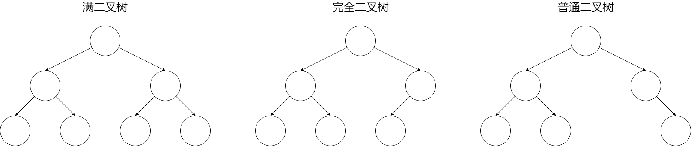
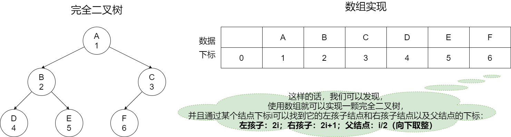

# 树

## 初识树

### 重要术语

1. 结点：树的元素
2. 父子关系：结点之间相连的边
3. 子树：当结点大于1时，其余的结点分为的互不相交的集合称为子树
4. 度：一个结点拥有的子树数量称为结点的度
5. 叶子：度为0的结点
6. 孩子：结点的子树的根称为孩子结点
7. 双亲（父结点）：和孩子结点相对应
8. 兄弟：同一个双亲结点
9. 祖父结点：双亲结点的双亲结点
10. 祖先结点：祖父结点及其双亲结点以及其双亲结点……
11. 森林：由N个互不相交的树构成森林
12. 结点的高度：结点到叶子结点的**最长**路径
13. 结点的深度：根结点到该结点的边个数
14. 结点的层数：结点的深度加1
15. 树的高度：根结点的高度

### 二叉树

一种特殊的树形结构，每个结点至多只有两颗子树。在二叉树的第N层至多有2^(N-1)个结点，最多有2^N-1个结点。

#### 满二叉树

除叶子结点外，每个结点都有左右两个子结点。

#### 完全二叉树

除最后一层外，其他的结点个数必须达到最大，且最后一层的结点都要连续靠左排序。

##### 完全二叉树的意义

如图是满二叉树、完全二叉树和普通的二叉树：

我们可以看到，完全二叉树是满二叉树的一部分，当我们考虑实现一颗二叉树时，一般只能考虑使用链表进行实现，但是，由于每个结点都要保留父结点、左孩子结点和右孩子结点，且链表不能把前后结点都加载进内存，所以可以优先考虑数组是极好的。

我们发现，刚好完全二叉树就可以使用数组进行实现，如图：

这样的话，使用数组实现二叉树又节省了空间又节省了时间。

#### 二叉树的遍历

四种遍历方式：前序遍历、中序遍历、后序遍历、层次遍历

口诀：**根节点输出**，前序根左右，中序左根右，后序左右根

只需要遍历到结点时只看该结点的子树，然后按照口诀，遇到根结点输出，遍历到最后回溯继续按照口诀遍历即可。

如：