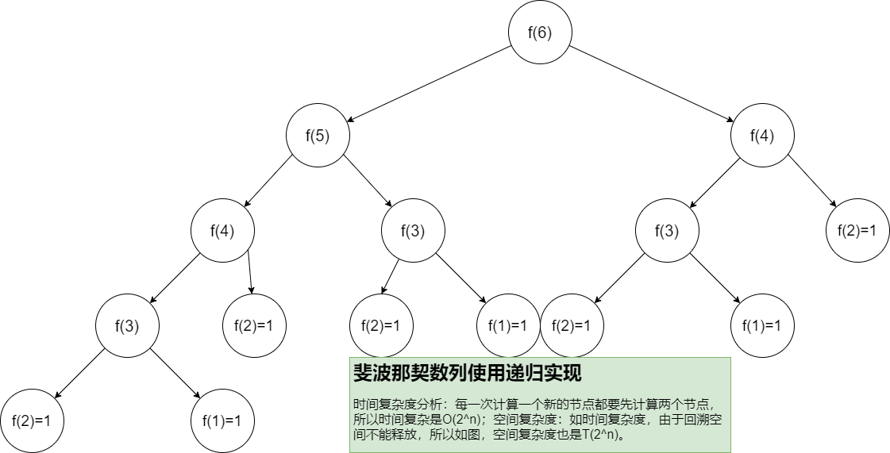

# 递归&分治&回溯

## 递归的定义

递归是一个非常重要的算法思想，应用也是相当的广泛，其实递归说起来很简单，生活中也是经常可以碰到这个场景：

比如我们在某窗口排队人太多了，我不知道我排在第几个，那么我就问我前面的人排第几个，因为知道他排第几我就知道我是第几了。但前面的人也不知道自己排第几那怎么办呢？他也可以继续往前面问，直到问到第一个人，然后从第一个人一直传到我这里 我就很清楚的知道我是第几了。

以上这个场景就是一个典型的递归。在这个过程中有一个规律那么就是会有一个问的过程，问到第一个后有一个回来的过程吧。这就是递（问）加归（回）。

我们发现，这个过程我们可以用一个数学公式来表达：

`f(n)=f(n-1)+1`，其中f(n)表示当前位置，f(n-1)表示当前位置的前一个位置；

## 什么样的情况下可以用递归

1. 一个问题的解可以分解为几个子问题的解：子问题，我们通过分治的思想可以把一个数据规模大的问题，分解为很多小的问题。比如前面所说的例子。
2. 这个问题与分解之后的子问题，求解思路完全一样。
3. 一定有一个最后确定的答案，即递归的终止条件：前面的例子第一个人是肯定知道自己排在第一的，这就是递归的终止条件、问题的出口，如果没有这个特性，那么我们这个递归就会出现死循环，最后程序就是栈溢出。

## 例题：斐波那契数列

递归的关键相信大家已经知道了就是要求出这个递归公式，找到终止条件。接下来我们试着做一道题：斐波那契数列。

`1, 1, 2, 3, 5, 8, 13 `这个的数列我们称之为斐波那契数列，他的求解公式：`f(n)=f(n-1)+f(n-2)`，终止条件：`n<=2 f(n)=1`

[https://github.com/JackLinkai/DataStructure-Algorithm/blob/master/src/main/algorithm/rec/Fibonacci.java](https://github.com/JackLinkai/DataStructure-Algorithm/blob/master/src/main/algorithm/rec/Fibonacci.java)

## 递归优化

（结合上面的例题和图片，我们发现如果直接使用递归因为调用的函数末尾还有操作，导致一部分运算结果要进行重复计算还不能释放空间，造成时间和空间上的浪费，因此我们要针对这个原因思考如何对递归进行优化：）

1. 使用非递归。所有的递归代码理论上是一定可以转换成非递归的。

2. 加入缓存：把我们中间的运算结果保存起来，这样就可以把递归降至为o(n)
3. 尾递归：什么是尾递归？尾递归就是调用函数一定出现在末尾，没有任何其他的操作了。因为我们编译器在编译代码时，如果发现函数末尾已经没有操作了，这时候就不会创建新的栈，而且覆盖到前面去。

尾递归的具体操作就是倒着算，从末尾开始往前算，直到最后把结果从终止条件中输出，而且我们不需要再回溯了，因为我们每次会把中间结果带下去。

递归确实是一个写代码的神器，可以看起来代码整洁以及可读性高，但是使用起来一定要注意栈溢出和时间问题，在没有把握使用尾递归的情况下，就用for循环或者使用数组保存中间结果。