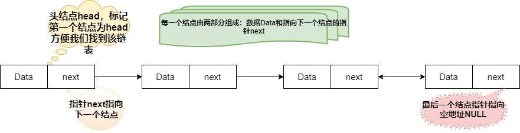
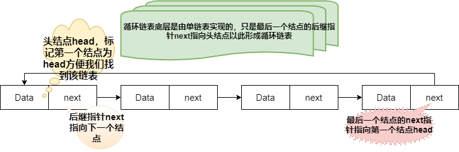
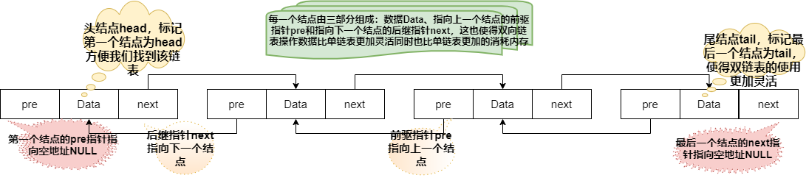

# 链表
## 链表的定义
链表通过指针将一组**零散的**内存块串联在一起，其中，我们把内存块称为链表的“结点”。为了把所有的结点串联起来，每个链表的结点除了存储数据之外，还需要记录链上的下一个结点的地址。
所以我们可以看出，链表首先是不能像数组一样可以随即访问的，并且同样长度的链表占用的内存空间也会比数组大。
总结出的特点：
1. 不需要连续的内存空间
2. 有指针引用
3. 三种最常见的链表结构：单链表、双向链表和循环链表
## 单链表

从单链表图中，可以发现，有两个结点比较特殊，它们分别是第一个结点（叫头结点）和最后一个结点（叫尾结点）；其中，头结点用来记录链表的基地址，我们可以用它来遍历得到整条链表；尾结点的指针不是指向下一个结点，而是指向一个空地址NULL，表示这是链表的最后一个结点。

### 单链表实现

[https://github.com/JackLinkai/DataStructure-Algorithm/blob/master/src/main/datastructure/list/MyLinkedList.java](https://github.com/JackLinkai/DataStructure-Algorithm/blob/master/src/main/datastructure/list/MyLinkedList.java)

## 循环链表

循环链表是一种特殊的单链表。单链表的尾结点指针指向空地址，表示这就是最后的结点了。而循环链表的尾结点指针是指向链表的头结点，如同一个环一样首尾相连，所以叫做“循环”链表。

## 双向链表

单向链表只有一个方向，结点只有一个后继指针next指向后面的结点。双向链表，顾名思义，它支持两个方向，每个结点不只有一个后继指针next指向后面的结点，还有一个前驱指针prev指向前面的结点。双向链表需要额外两个空间来存储后继结点和前驱结点的地址。
因此存储同样多的数据，双向链表会比单向链表占用更多的内存空间。不过因为支持双向遍历，比起单向链表在数据的操作上也是更加的灵活。
在实际的应用上比如MySQL数据库索引底层的B+树它的叶子节点就是一个双向链表。

### 双向链表实现

[https://github.com/JackLinkai/DataStructure-Algorithm/blob/master/src/main/datastructure/list/MyDoubleLinkedList.java](https://github.com/JackLinkai/DataStructure-Algorithm/blob/master/src/main/datastructure/list/MyDoubleLinkedList.java)

## 例题1：设计一个LRU缓存淘汰算法
最近最少使用，只需要维护一个有序的单链表就可以了。有序的指的就是加入的时间排序。
思路：新加一个点，如果在链表里面找到了，删掉然后插入到头部，头部就是最新的；如果不在原来的链表，有空间就插入到头部，没有空间就删除最后一个结点然后插入到头部。

## 例题2：约瑟夫问题（丢手绢）
约瑟夫问题是个有名的问题：N个人围成一圈，从第一个开始报数，第M个将被杀掉，最后剩下一个，其余人都将被杀掉。例如N=6，M=5，被杀掉的顺序是：5，4，6，2，3，1。
现在问你最后留下的人是谁？
比如N=6，M=5
留下的就是1
1 2 3 4 5 6 => 6 1 2 3 4 => 6 1 2 3 =>1 2 3 => 1 3 => 1
思路：单循环链表

[https://github.com/JackLinkai/DataStructure-Algorithm/blob/master/src/main/datastructure/list/Test1.java](https://github.com/JackLinkai/DataStructure-Algorithm/blob/master/src/main/datastructure/list/Test1.java)

## 数组和链表的区别：
| 操作的时间复杂度 | 数组 | 链表 |
| :--------------: | :--: | :--: |
|     插入删除     | O(n) | O(1) |
|     随即访问     | O(1) | O(n) |
1. 数组简单易用，在实现上使用的是**连续**的内存空间，**可以借助CPU的缓存机制预读数组中的数据，所以访问效率更高（CPU的空间局部性原理）**
2. 链表在内存中并不是连续存储的，所以对CPU的缓存不友好，没办法有效预读
3. 数组的缺点是大小固定，一经声明就要占用整块连续的内存空间。如果声明的数组过大，系统可能没有足够的连续的内存空间分配给它，导致“内存不足（out of memory）”；如果声明的数组过小，则可能出现不够用的情况。
4. 动态扩容：数组需要再申请一个更大的内存空间（ArrayList内部的扩容机制为扩容因子0.75，长度为原来的2倍），把原数组拷贝进去，很耗时间。链表本身没有大小限制，天然地支持动态扩容。