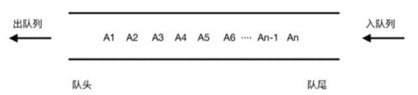
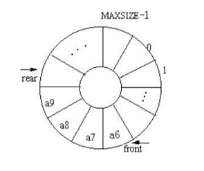
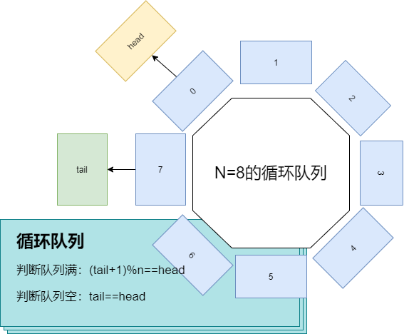

# 队列

## 队列的定义

定义：队列是一种特殊的线性表，特殊之处在于它只允许在表的前端（front）进行删除操作，而在表的后端（rear）进行插入操作，和栈一样，队列是一种操作受限制的线性表。进行插入操作的端称为队尾，进行删除操作的端称为队头。队列中没有元素时，称为空队列。

队列的数据元素又称为队列元素。在队列中插入一个队列元素称为入队，从队列中删除一个队列元素称为出队。因为队列只允许在一端插入，在另一端删除，所以只有最早进入队列的元素才能最先从队列中删除，故队列又称为先进先出（FIFO—first in first out）线性表，LIFO。树

队列这个概念非常好理解。你可以把它想成排队买票，先来的先买，后来的人只能站末尾，不允许插队。先进者先出，这就是典型的“队列”。

栈：后进先出。

## 队列的特点

（1）线性表：所以可以用链表或者数组实现

（2）FIFO先进先出

## 队列的分类

（1）顺序（单向）队列：（Queue） 只能在一端插入数据，另一端删除数据

（2）循环（双向）队列（Deque）：每一端都可以进行插入数据和删除数据操作，避免了空间的浪费，天然支持数据移动，当然元素也只能从front端或者rear端进或者出

## 队列的基本操作

我们知道，栈只支持两个基本操作：入栈push()和出栈pop()。

队列跟栈非常相似，支持的操作也很有限，最基本的操作也是两个：

入队enqueue()，放一个数据到队列尾部；

出队dequeue()，从队列头部取一个元素。

所以，队列跟栈一样，也是一种操作受限的线性表数据结构。作为一种非常基础的数据结构，队列的应用也非常广泛，特别是一些具有某些额外特性的队列，比如循环队列、阻塞队列、并发队列。它们在很多偏底层系统、框架、中间件的开发中，起着关键性的作用。

## 队列的实现方式

我们可以考虑使用数组或者链表来实现队列，但是如果使用链表，由于链表是可以无限扩容的，在有些情况下需要考虑控制容量的大小（比如CPU），同时，链表不支持借助CPU的缓存机制预读数据。

### 数组实现单向顺序队列

[https://github.com/JackLinkai/DataStructure-Algorithm/blob/master/src/main/datastructure/queue/ArrayQueue.java](https://github.com/JackLinkai/DataStructure-Algorithm/blob/master/src/main/datastructure/queue/ArrayQueue.java)

### 数组实现单向循环队列

怎么判断队列已经满了？

1. 加一个实际的使用容量size变量
2. (tail+1)%n==head

如图：

这也给了我一些启示：在环状的数据结构处理数据时或许可以考虑使用%进行定位。

见代码：

[https://github.com/JackLinkai/DataStructure-Algorithm/blob/master/src/main/datastructure/queue/CycleArrayQueue.java](https://github.com/JackLinkai/DataStructure-Algorithm/blob/master/src/main/datastructure/queue/CycleArrayQueue.java)

### 链表实现单向顺序队列

[https://github.com/JackLinkai/DataStructure-Algorithm/blob/master/src/main/datastructure/queue/LinkedQueue.java](https://github.com/JackLinkai/DataStructure-Algorithm/blob/master/src/main/datastructure/queue/LinkedQueue.java)